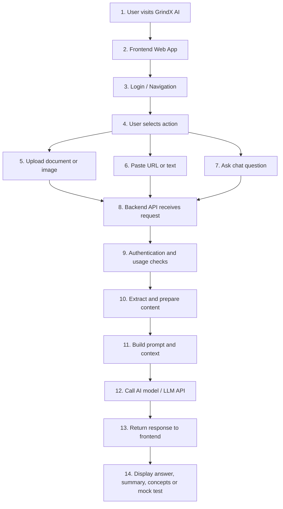

# GrindX AI – Architecture Notes

## 1. Project Overview

GrindX AI is a full-stack Generative AI application that helps users work with documents, images, URLs and study/work content.

The application supports document-aware AI chat, OCR/image input, URL analysis, summaries, key concepts, practice questions, mock tests, translation, audio features, authentication and usage controls.

The goal of the project is to demonstrate practical AI engineering: building a complete user-facing application around AI workflows, not only calling an AI model.

---

## 2. High-Level Application Flow



---

## 3. Frontend Role

The frontend handles the user-facing experience:

- Login and navigation
- File upload interface
- AI chat interface
- URL input and analysis flow
- Prompt/action buttons
- Loading states
- Error messages
- Displaying AI responses
- Public information pages such as privacy, terms and academy pages

The frontend does not store AI secrets or API keys. It sends user requests to the backend API.

---

## 4. Backend Role

The backend handles the main AI and business logic:

- Receiving frontend requests
- Validating user input
- Authentication and usage checks
- File/document processing
- OCR or image-related processing
- URL content processing
- Prompt workflow handling
- Preparing context for the AI model
- Calling the AI model/API
- Handling errors and responses
- Returning structured output to the frontend

The backend controls the main AI workflow.

---

## 5. AI Workflow

A typical AI workflow in GrindX AI is:

```text
User submits content or question
  ↓
Backend validates request
  ↓
Backend prepares or extracts content
  ↓
Backend builds useful context
  ↓
Backend sends prompt + context to AI model
  ↓
AI model generates response
  ↓
Backend handles response
  ↓
Frontend displays result to user
```

This design keeps the AI workflow controlled in the backend instead of exposing model calls directly from the frontend.

---

## 6. Document Chat / OCR / URL Flow

For document-based use cases:

```text
Document upload
  ↓
Text extraction / OCR if required
  ↓
Content preparation
  ↓
User asks question
  ↓
Relevant context is sent to the AI model
  ↓
AI response is returned to the user
```

For image or scanned content, OCR is required before the extracted text can be used in the AI workflow.

For URL analysis, the application collects or prepares page content, builds context and sends the relevant information to the model.

---

## 7. RAG Direction

RAG stands for Retrieval-Augmented Generation.

The planned Azure RAG direction is:

```text
Documents
  ↓
Extract text
  ↓
Split into chunks
  ↓
Create embeddings
  ↓
Store/index in Azure AI Search
  ↓
User asks a question
  ↓
Retrieve relevant chunks
  ↓
Send chunks + question to Azure OpenAI
  ↓
Return grounded answer with references
```

RAG helps reduce hallucination because the model answers using retrieved content instead of relying only on general model knowledge.

---

## 8. Azure Services Mapping

| Requirement | Azure Service |
|---|---|
| LLM / chat / summaries | Azure OpenAI |
| AI project/model management | Azure AI Foundry |
| Document extraction | Azure AI Document Intelligence |
| Image/OCR scenarios | Azure AI Vision / Document Intelligence |
| RAG search/index | Azure AI Search |
| Secure secrets | Azure Key Vault |
| File storage | Azure Storage |
| App/API hosting | Azure App Service / Container Apps / Functions |
| Monitoring | Application Insights |

---

## 9. Low-Code vs Pro-Code

GrindX AI uses a pro-code approach for the main application because it requires:

- Custom authentication
- Document upload handling
- OCR/image input
- URL analysis
- Prompt workflows
- Usage controls
- Backend AI logic
- Custom user experience

A low-code option such as Copilot Studio is better suited for simpler use cases such as:

- Pre-login help assistant
- FAQ support
- User onboarding
- Teams/internal assistant
- Simple workflow automation

For example, a GrindX AI Help Assistant can be created with Copilot Studio to answer new-user questions from public website content.

---

## 10. Security and Cost Control

Important production considerations include:

- Do not expose API keys in frontend code
- Store secrets in environment variables or Azure Key Vault
- Use authentication and authorization
- Ensure users only access their own data
- Add usage limits and rate limits
- Monitor token/API usage
- Add Azure budget alerts
- Log errors without exposing sensitive data
- Avoid sending unnecessary private data to AI models

---

## 11. Production Considerations

A production-style AI application needs:

- Good user experience
- Backend workflow control
- Secure configuration
- Error handling
- Usage monitoring
- Cost control
- Response reliability
- Clear fallback behaviour
- Safe handling of user content
- Deployment and monitoring process

The main learning from GrindX AI is that a real AI application is more than an LLM call. The value is in the full workflow around the model.

---

## 12. Technical Summary

GrindX AI demonstrates practical AI application development across:

- Full-stack web application structure
- Frontend/backend integration
- AI model/API integration
- Document-aware AI workflows
- OCR/image input concepts
- URL analysis
- Prompt workflows
- Usage controls
- Authentication-aware design
- Azure AI direction
- Low-code vs pro-code decision making

The project shows practical AI engineering focused on building usable AI products, not only experimenting with AI models.
